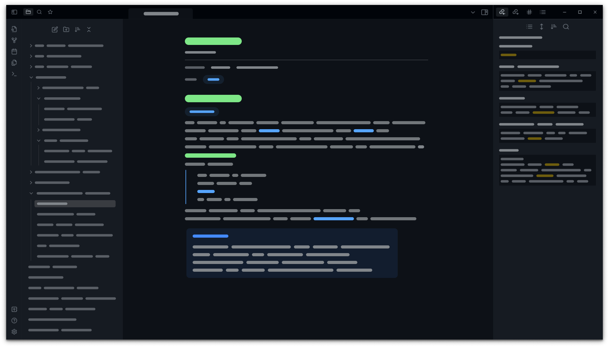

# Obsidain GitHub theme

## Preview

Screenshots

## How to Install
1. Download `theme.css` and `manifest.json` files from latest [release](https://github.com/krios2146/obsidian-github/releases/)
2. Go to **/your_vault/.obsidian/themes/** and create folder for theme files
3. Paste downloaded theme files into created folder
4. In Obsidian go to Settings -> Appearance -> select GitHub theme in dropdown menu

Make sure that your Base color scheme is **dark**

## Supported plugins
Most plugins should work well with a GitHub theme if their not, let me know in [issues](https://github.com/krios2146/obsidian-github/issues). 

List of specially styled plugins is shown below:

 - Kanban cards was been styled like a GitHub Projects cards 

## Contributing
Feel free to open [issue](https://github.com/krios2146/obsidian-github/issues) on GitHub if you find some issue/bug with theme or you want me to add some plugin support. 

You also can open a [pull request](https://github.com/krios2146/obsidian-github/pulls) if you already add some plugin support or fix bugs by yourself.
